<p align="center">
  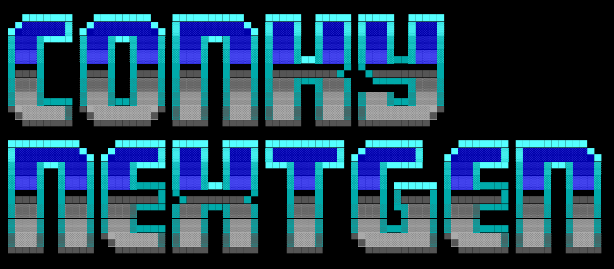
</p>

# Conky NextGen

Conky NextGen is a modular Conky framework with a Lua/Cairo renderer, Bash
data fetchers, self-contained themed widgets, and a GTK3 visual Designer. It
supports X11 and Wayland-capable Conky builds.

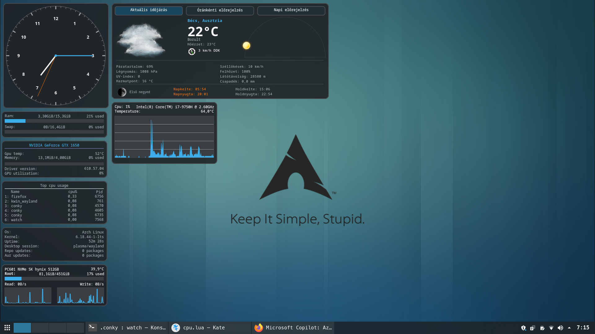

## Quick start

```bash
git clone git@github.com:molnari811023/conky-nextgen.git ~/.conky
cd ~/.conky

# Fetch weather, alerts, maps, media, network, and optional Google data.
bash sh/fetch_all.sh

# Start a widget.
conky -c clock_cal.conf

# Start the visual Designer.
python3 sh/designer/main.py
```

The default weather location is Vienna. Supply a city name to fetch weather
for another location:

```bash
bash sh/fetch_all.sh Budapest
```

The Designer writes widget files atomically and sends `SIGUSR1` to reload the
live preview without restarting the Conky process.

## Included widgets

Every root-level `.conf` file starts the matching `.lua` widget. The current
bundles are:

| Widget | Purpose |
|---|---|
| `clock_cal` | analog clock and calendar |
| `cpu`, `mem_swap`, `disk`, `nvidia` | system, memory, storage, and GPU information |
| `info`, `top`, `left` | system dashboards and multi-view layouts |
| `weather` | current, hourly, and daily weather views |
| `lyrics` | synchronized lyric display |
| `widget` | Designer-managed general-purpose widget |

## Screenshots

| Clock and calendar | Calendar view | System information |
|:---:|:---:|:---:|
| 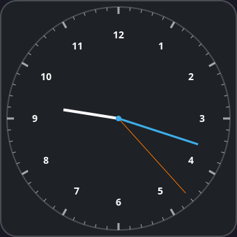 | 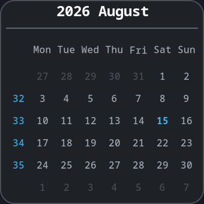 | 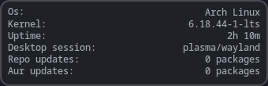 |

| CPU | CPU alternative view | Memory and swap |
|:---:|:---:|:---:|
| 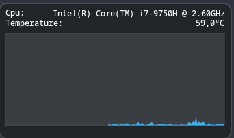 | 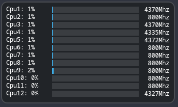 | 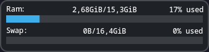 |

| Disk | NVIDIA GPU | Top processes | Top processes alternative view |
|:---:|:---:|:---:|:---:|
|  | 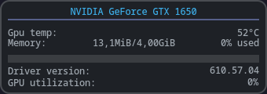 | 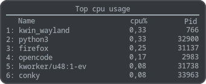 | 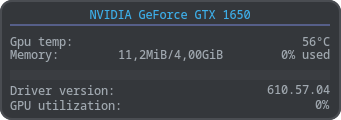 |

| Current weather | Hourly forecast | Daily forecast |
|:---:|:---:|:---:|
| 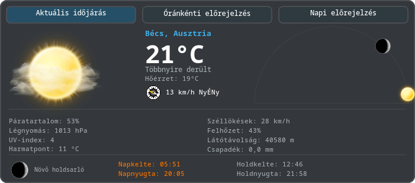 | 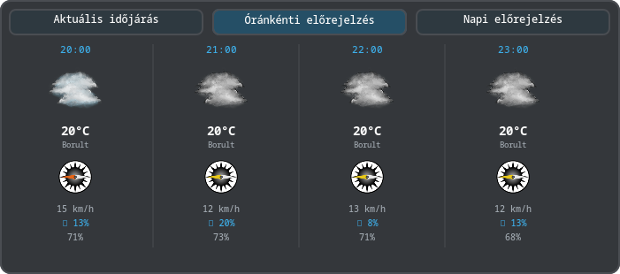 | 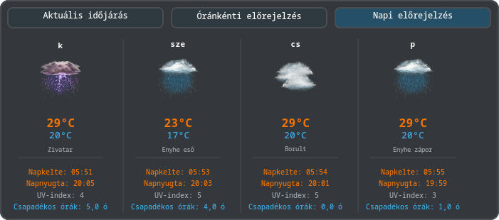 |

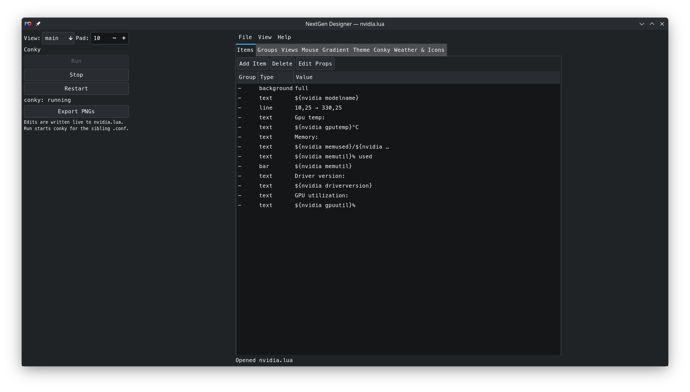

## Designer

Run the GTK3 Designer with:

```bash
python3 sh/designer/main.py
```

It edits `widget.lua` and `widget.conf`, provides a live Conky preview, and
includes widget, theme, view, group, mouse, weather, and Conky configuration
controls. Module profiles are fixed checkboxes in the left-side **Profile**
panel, so selecting them does not cover any other control.

Profiles choose data modules while every visual renderer remains available:

| Profile | Loads data for |
|---|---|
| `basic` | no additional data source |
| `weather` | weather, alerts, air quality, sun, moon, city, and icons |
| `system` | hardware, battery, DMI, MTP, network, sensors, and USB |
| `media` | now-playing and song-text data |
| `panel` | panel system data |
| `google` | Google cache data |
| `full` | weather, system, media, and Google data |

Profiles can be combined, for example:

```lua
MODULE_PROFILE = { "weather", "media" }
```

`full` is exclusive. Invalid profile definitions, missing required modules,
and invalid Lua renderer expressions fail explicitly instead of being silently
ignored.

## Fetching data

All fetchers are Bash scripts. Run them with `bash`, not a generic `sh`
wrapper. They update the generated `tmp/` cache, which is intentionally not
stored in Git.

| Command | Purpose |
|---|---|
| `bash sh/fetch_all.sh` | fetch all regular data |
| `bash sh/fetch_all.sh weather` | fetch weather only |
| `bash sh/fetch_all.sh alerts` | fetch MeteoAlarm alerts |
| `bash sh/fetch_all.sh map` | fetch weather maps |
| `bash sh/fetch_all.sh nowplaying` | fetch media-player data |
| `bash sh/fetch_all.sh network` | fetch ping and public-IP data |
| `bash sh/fetch_all.sh google` | fetch optional Google data through `gog` |
| `bash sh/fetch_updates.sh` | fetch the optional Arch update counter |

For periodic refreshes, use Bash explicitly in cron:

```cron
0 * * * * /bin/bash /path/to/conky-nextgen/sh/fetch_all.sh && /bin/bash /path/to/conky-nextgen/sh/fetch_updates.sh
```

## Requirements

Package names vary between distributions. The project needs:

- Conky built with Lua, Cairo, Xft, Imlib2, and RSVG support;
- Python 3 with PyGObject/GTK3 for the Designer;
- Bash, `curl`, `jq`, and `python3` for the fetcher framework;
- Lua bindings including `cairo`, `rsvg`, `imlib2`, `lfs`, and `dkjson`;
- `ImageMagick` for map images and `ping` for network latency;
- optional tools according to enabled modules: `playerctl`, `cmus-remote`,
  `mpc`, `mocp`, `gog`, `lm-sensors`, `upower`, and Arch package tools.

## Project layout

```text
.
├── *.lua / *.conf   standalone widget bundles
├── debug/           renderer stress tests and diagnostics
├── icons/           weather, moon, wind, and UI assets
├── language/        gettext catalogs and translation template
├── lua/             core engine, renderers, and data modules
├── panel_systray/   panel and systray helper sources/configuration
├── pkg/             package build files and patches
├── sh/              fetchers and the GTK3 Designer
├── tools/           development utilities
└── tmp/             generated runtime cache
```

## Documentation and validation

The detailed, source-derived reference is in
[NextGen.md](NextGen.md). It documents the renderer properties, Lua modules,
fetchers, Designer components, profiles, translations, panel integration, and
debug tooling.

Run the Designer schema and round-trip regression test with:

```bash
cd sh/designer
python3 tests/test_widget_schema.py
```
